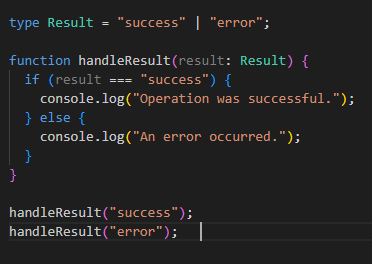
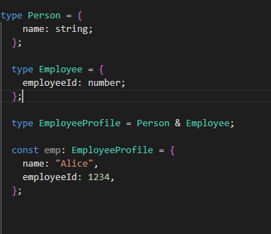

# What are some differences between interfaces and types in TypeScript?

   ## Interface: 
   An interface at Typescript is a way to define a contract for the structure of an object.It tells to typescript compiler that what type of properties and method should have an object.Interface is best used when we want to define object shapes and are especially useful  when working with class.

   Interface are open ,we can declare the same interface multiple times,then Typescript will automatically  combine them.It's declaration merging.

   ## Types:  
      A type is a more flexible way to give a name to any type,not just object structure .We can use to define  
      Primitives(e.g type Age=number)  
      Unions(e.g. type Id=string|number) 
      Tuples(e.g. type Point=[number,number]) 
      Complex mapped and conditional types  
      

# Provide an example of using union and intersection types in TypeScript.

 ## Union type example
   A union type allows a variable to be one of several types:  
   
   
 
 ## Intersection Type example
 An intersection type combines multiple types into one. The resulting type has all the properties from the combined types: 

 

     

        

